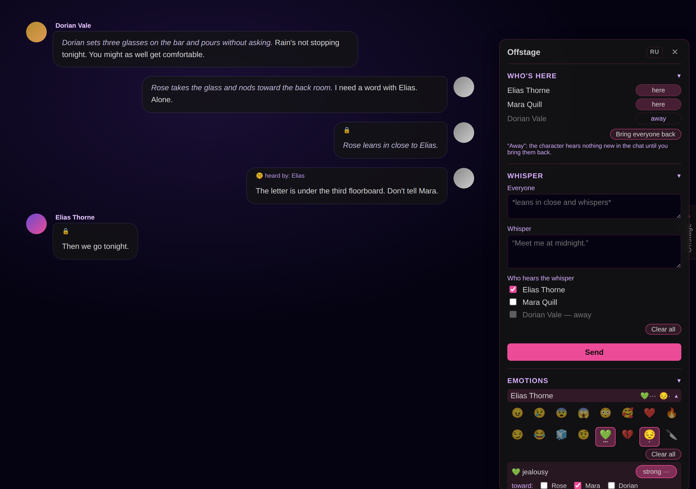
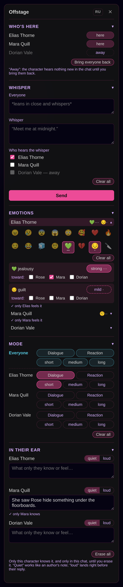

# Offstage

A side panel for **group roleplay scenes** in [Marinara Engine](https://github.com/Pasta-Devs/Marinara-Engine).
In the middle of a scene, without slash commands or digging through lorebooks, you decide
who is in the room, who hears a whisper, what a character feels, and how they answer next.



> Built and used on **Marinara Engine 2.4.6** (Windows host, played from Chrome and an iPad).
> The interface is in **English and Russian**; the switch is in the panel's header.

## What it does

A tab labeled **Offstage** sits on the right edge of any chat. It opens a floating panel with
five sections. Tap a section's heading to fold it.

**Who's here.** Each character has a *here / away* switch. While a character is away, every
new message is hidden from them. Bring them back and they hear new messages again, but what
happened without them stays hidden from them for good. **Bring everyone back** does it for
all at once.

**Whisper.** Two boxes: **Everyone** (what all characters see, e.g. *leans in close*) and
**Whisper** (what only the checked characters hear). They are sent as two messages from you;
the second is hidden from everyone who isn't checked.

**Emotions.** Sixteen emotions per character: anger, jealousy, tenderness, fear, guilt,
cruel impulse and more. Up to three at a time, each with an intensity (mild / normal / strong)
and an optional target ("jealousy → Mara"). The character receives this as a hidden
undercurrent that colors their behavior instead of being announced; they say it out loud only
when they're aware of it and ready to.

**Mode.** A per-character instruction for the next replies: **Dialogue** or **Reaction**
(silent, action only), and a length: **short / medium / long**. Set it for **Everyone** or
for one character; a personal setting wins. It stays on until you release the button.

**In their ear.** A note only one character knows, in this chat only. **Quiet** works like an
author's note; **loud** lands right before their reply.

**Markers.** Hidden messages get a small label that only you see: 🔒 hidden from those who
were away, 🤫 *heard by: …* on whispers. The model never sees the labels.



## Requirements

- Marinara Engine 2.4.6 or close to it.
- A **group chat** in **Individual** mode for whispers and *away*
  (chat settings → Group Chat → Mode). Emotions, mode and notes should work in one-on-one
  chats too, but group chats are where it has been tested.
- Desktop or mobile browser. On touch screens there are no hover tooltips.

## Install

Offstage is an **External Extension with full page access**, so Marinara asks you to unlock
third-party extensions first.

1. **Allow external extensions on the host.** Open the `.env` file in your Marinara folder
   (on Windows usually `%LOCALAPPDATA%\Marinara-Engine\.env`) and set
   ```
   ENABLE_EXTERNAL_EXTENSIONS=true
   ```
   Add the line if it isn't there. Restart Marinara.
2. **Allow imports in the app.** **Settings → Advanced → Danger Zone**, scroll down, read the
   warning and turn on **Allow third-party extension imports**.
3. **Import.** Download `Offstage-<version>.personal-extension.zip` from
   [Releases](../../releases) (don't unzip it). **Settings → Addons → External Extensions →
   Import Extension File** and pick the zip. (**Import Extension Folder** takes this
   repository's `offstage` folder instead.)
4. **Approve.** Offstage appears disabled, marked *Needs approval · Full page access*. Open it,
   press **Enable** and confirm **Run Exact Code**.
5. Open a group chat: the **Offstage** tab appears on the right.

Using Marinara from a phone or another computer on your network? Importing also needs admin
access: set `ADMIN_SECRET` on the server and enter the same value under
**Settings → Advanced → Admin Access**. Once installed, the panel loads in every browser that
opens your Marinara.

**Update:** import the new zip and confirm **Save Disabled Update**, then **Enable → Run Exact
Code** again. Your settings and chats are kept. **Remove:** Disable, then delete it in
External Extensions.

## Optional: give Mode the last word

By default the mode instruction is inserted into the chat history right before the reply.
If your preset has rules about length that come *after* the chat history, they come later and
can win. To make Offstage speak last, put this macro **at the very end of the last preset
section that follows the chat history**:

```
{{outlet::Offstage}}
```

The next time you open the panel or press a mode button, the mode instructions move there.
An empty outlet adds nothing to the prompt when no mode is pressed.

## Why full page access

Marinara's safe sandbox can't do what this panel needs. A sandboxed extension can't read
messages, can't hide a message from one character, and can't write lorebook entries or chat
metadata. So Offstage runs as page code, like WeatherTweaker and other pre-sandbox
extensions. Here is everything it does:

- **Talks only to your own Marinara** through `marinara.fetch` (so Marinara counts its
  traffic). No outside network, no analytics.
- **Reads** characters, personas, the open chat, its messages, its own lorebook, and the
  chat's preset (only to look for the outlet macro).
- **Writes:**
  - your two messages when you send a whisper (**Everyone** and **Whisper**);
  - per-message `hiddenFromAICharacterIds` (Marinara's own "hide from this character" flag)
    plus a small `kulisy` note in the message's `extra`;
  - chat metadata keys: `kulisyAway`, `kulisyFeelings`, `kulisyMode`, `kulisyEarLorebookId`;
  - one lorebook per chat, **"In their ear — <chat name>"**, bound to that chat only. It holds
    the notes plus the entries **"Emotions — <name>"** and **"Mode — <name>"**. Each entry
    is constant and filtered to a single character. The panel creates, updates and deletes
    entries in this lorebook only.
- **Touches the page**, and undoes all of it when you disable the extension:
  - wraps `localStorage.setItem/removeItem` to learn which chat is open *in this tab*;
  - finds Marinara's React Query client, reads cached messages and refreshes them right away;
  - watches the page (a MutationObserver) to put the 🔒 / 🤫 labels on message bubbles as a
    `data-kulisy-note` attribute;
  - listens for Escape and for taps outside the panel. A tap outside only closes the panel;
    the click right after it is swallowed so you don't press something underneath by accident;
  - adds its own tab and panel (Marinara itself injects the stylesheet).
- **Remembers** your whisper checkboxes and the panel language in its private extension
  storage (plus `modeTexts`, a legacy key from the Russian version), and folded sections in
  `localStorage` per device.

The code is one readable file, [`offstage/extension.js`](offstage/extension.js). Please read
it before approving: that's what the approval step is for.

("Kulisy" is the panel's original Russian name, *Кулисы*, "the wings of a stage". Internal
keys keep it so older chats keep working.)

## Known limitations

- **Summaries leak secrets.** Marinara's chat summary (the button and auto-summary) includes
  every message that isn't hidden from *all* characters. Whispers and what happened while
  someone was away end up in the shared summary. If secrets matter, keep auto-summary off.
- **Lorebook keywords ignore hiding.** Keyword scanning reads the latest messages as a whole:
  if a whisper contains a keyword, that entry fires for characters who didn't hear it.
  Per-character entry filters still work.
- **A short window when someone leaves.** New messages are hidden from absent characters
  0.2–2 seconds after they appear. If you trigger an absent character's reply in that moment,
  they may see the newest message.
- **The panel uses Marinara's internals:** message bubble classes, the React Query cache,
  `/api` routes. A Marinara update can break it. If it does, disable it and open an issue.
- **Deleting a chat doesn't delete its "In their ear" lorebook.** Remove it by hand in
  Lorebooks.
- **Switching the language** rewrites the text of the open chat's emotion and mode entries;
  other chats follow when you open them. Lorebook and entry *names* keep the language they
  were created in (the panel recognizes both). Free-text notes stay as you wrote them.
- **English instructions were tested lightly.** The mode texts were tuned on Russian roleplay
  and checked in English on DeepSeek V3. Different models obey length rules differently.

## Language

On first run the panel picks Russian if your browser is set to Russian, English otherwise, and
remembers it. The **RU / EN** button in the header switches it for every device that opens
your Marinara.

## License

[MIT](LICENSE). Emoji are your system's own.
