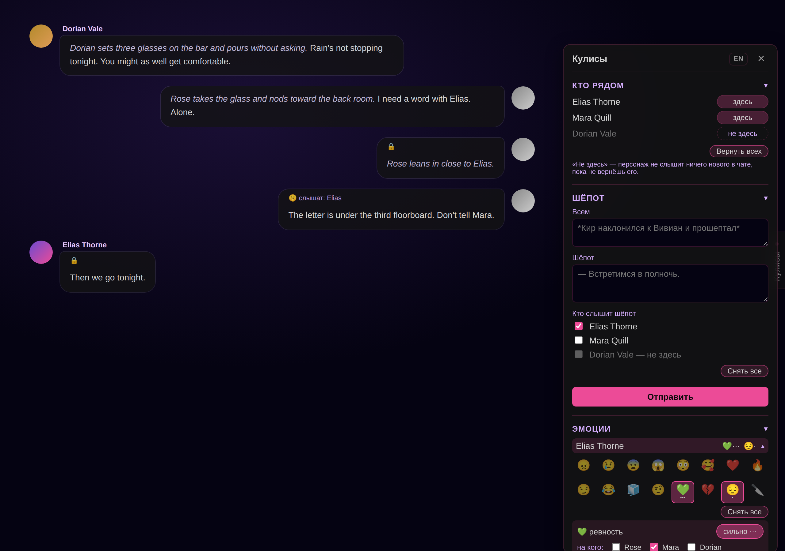

# Offstage (Кулисы)

Панель для **групповых сцен** в [Marinara Engine](https://github.com/Pasta-Devs/Marinara-Engine).
Посреди игры, без команд и без захода в лорбук: кто в комнате, кто слышит шёпот, что
персонаж чувствует и как ответит дальше. Интерфейс русский и английский, переключатель в
шапке панели.

> Сделано и проверено на **Marinara Engine 2.4.6**. Подробное описание, установка с
> пояснениями и честный список ограничений — в [README на английском](README.md).

## Что умеет

- **Кто рядом.** «Здесь / не здесь». Пока персонажа нет, всё новое в чате от него скрыто;
  вернулся — слышит снова, но пропущенное так и остаётся для него скрытым.
- **Шёпот.** Поле «Всем» (видят все) и «Шёпот» (слышат только отмеченные галочками).
- **Эмоции.** 16 эмоций, до трёх сразу, сила (слабо / норм / сильно) и «на кого».
  Персонаж получает их как скрытый фон поведения.
- **Режим.** «Диалог / Реакция» и длина «коротко / средне / длинно» — всем или одному.
- **На ухо.** То, что знает только этот персонаж и только в этом чате. «Тихо» — как заметка
  автора, «громко» — прямо перед его ответом.
- **Пометки.** 🔒 и 🤫 «слышат: …» на скрытых сообщениях видишь только ты, модель — нет.

Шёпот и «не здесь» работают только в групповом чате в режиме **Individual**
(шестерёнка чата → Group Chat → Mode).

## Как поставить

1. В файле `.env` в папке маринары (на Windows обычно `%LOCALAPPDATA%\Marinara-Engine\.env`)
   поставь `ENABLE_EXTERNAL_EXTENSIONS=true` (нет строки — допиши) и перезапусти маринару.
2. **Settings → Advanced → Danger Zone** → включи **Allow third-party extension imports**.
3. Скачай `Offstage-<версия>.personal-extension.zip` из [Releases](../../releases),
   не распаковывай. **Settings → Addons → External Extensions → Import Extension File** →
   выбери архив.
4. Открой Offstage (*Needs approval · Full page access*) → **Enable** → **Run Exact Code**.
5. В чате справа появится язычок **Кулисы** (или **Offstage** по-английски).

Обновление — так же: импорт нового архива → **Save Disabled Update** → **Enable** →
**Run Exact Code**. Настройки и чаты сохраняются.

С телефона или с другого компьютера импорт требует ещё `ADMIN_SECRET` на сервере и то же
значение в **Settings → Advanced → Admin Access**.

**Чтобы «Режим» звучал последним**, допиши в самый конец последней секции пресета, которая
идёт после истории чата: `{{outlet::Offstage}}` (или `{{outlet::Режим}}`).

## Важно знать

- Пересказ чата маринары (кнопка и автопересказ) берёт и шёпот, и то, что было «не здесь»:
  в общем пересказе это узнают все. Держишь тайны — автопересказ не включай.
- Ключи лорбука не знают про шёпот: слово-ключ из шёпота сработает и у тех, кто не слышал.
- Панель опирается на внутренности маринары — после её обновления может сломаться.
- Удаление чата не удаляет его лорбук «На ухо» — удаляй руками.

Почему нужен полный доступ к странице и что именно панель трогает — в
[английском README](README.md#why-full-page-access). Лицензия — [MIT](LICENSE).
